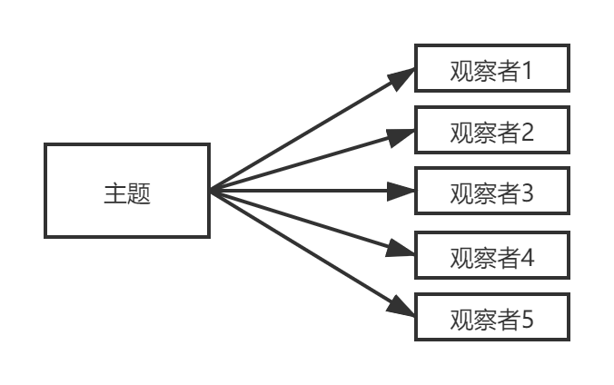
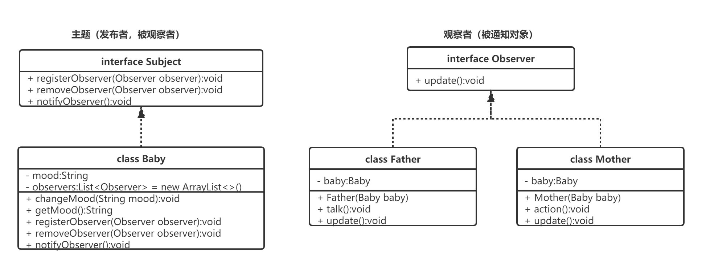

观察者模式

二、设计实现
需求分析与系统设计
首先有这么一个场景：爸爸妈妈照顾宝宝，在宝宝的心情发生变化时，爸爸妈妈要做出相应的回应，此处我们就设计为当宝宝情绪变化时爸爸会说话，妈妈会行动。
于是设计以下类图：

从上面的类图种可以看出所有的角色被分为两大类，主题（宝宝）和观察者（爸爸妈妈）。
主题（宝宝）的角色里会维护一个观察者（爸爸妈妈）集合，当心情变化时通知观察者集合里的所有人。
抽象出来接口就需要有三个方法，分别是向集合里添加观察者、移除观察者集合里的观察者、通知所有观察者。
观察者（爸爸妈妈）的角色需要有一个接收通知的方法，这个方法就可以抽象出来一个观察者接口。
测试结果
    爸爸知道了宝宝的心情：高兴
    爸爸说：宝宝心情变成高兴
    妈妈知道了宝宝的心情：高兴
    妈妈抱起了宝宝
    爸爸知道了宝宝的心情：哭闹
    爸爸说：宝宝心情变成哭闹
    妈妈知道了宝宝的心情：哭闹
    妈妈抱起了宝宝
三、在SpringBoot中应用观察者模式
定义事件
定义事件监听者

