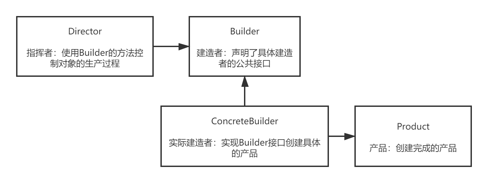

## 建造者模式（Builder）
+ https://blog.csdn.net/sinat_27245917/article/details/107485261
  + 一、建造者模式介绍
     - 建造者模属于设计模式中的创建型模式。建造者模式提供了一种最佳的创建对象的方式。建造者模式将一个复杂的对象的构建与其表示分离，使得同样的构建过程可以创建不同的表示。
+ 二、建造模式的实现方式
  - 方式一
    - 建造过程：客户端直接和Director（指挥者）沟通；
      通过向Director传入不同的ConcreteBuilder（具体建造者）构建不同表示的Product（产品）。
   
    - 方式二
      方式一是建造者模式的标准模式，除了上面的方式，还有一种常见的方式，可以解决使用多参数构造方法创建对象不够直观的问题。
  + 三、建造者模式和工厂模式的比较
    - 建造者模式创建的是同一个类不同表示的对象；工厂模式创建的是不同的类的不同的对象。
    - 抽象工厂模式可以创建一系列同一个产品族的产品（如：电脑的各种配件），建造者模式可以把一系列同一个产品族的产品组装成更复杂的产品（电脑）。