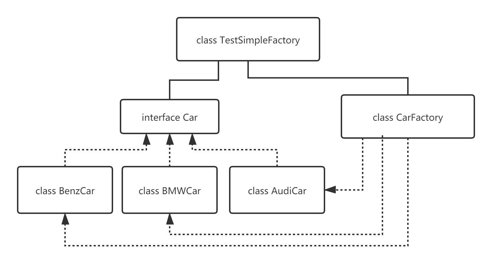
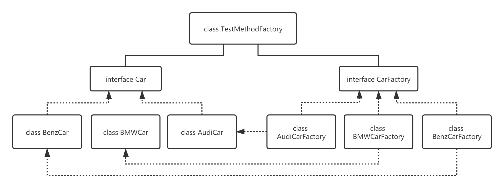
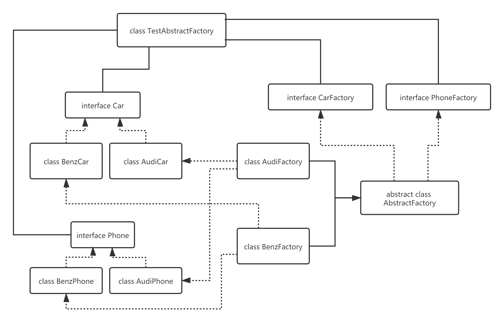

## 工厂模式
+ 设计模式学习笔记：工厂模式（Factory）
+ https://blog.csdn.net/sinat_27245917/article/details/107338278
+ 一、工厂模式介绍
    - 工厂模式属于设计模式中的创建型模式。工厂模式提供了一种最佳的创建对象的方式。工厂模式从简单到复杂有三种：简单工厂、工厂方法、抽象工厂。
+ 三种工厂模式的简单区分：
    - 简单工厂：根据传递给工厂类的不同参数创建不同的产品。例如：给生产汽车的工厂传递不同的参数生产不同的汽车。
    - 工厂方法：根据自己的需要使用不同的工厂来生产产品。例如：我要一辆奥迪汽车，那么就找奥迪汽车的工厂来生产奥迪汽车。
    - 抽象工厂：根据自己的需要使用不同的工厂来生产同一个产品族的多个产品。例如：我要一辆奥迪汽车，还要奥迪牌的手机（假如奥迪生产手机）， 那么就找奥迪的工厂来生产奥迪汽车和奥迪手机。

+ 二、工厂模式的三种不同实现
- 1、简单工厂模式
顾名思义，简单工厂模式真的很简单，就是对对象创建做了一层简单的封装，根据不同的参数创建不同的对象。

- 例如：汽车工厂生产不同的汽车。类图如下：

- 2、工厂方法模式
- 简单工厂的方式存在一个比较大的问题，那就是每当新增一种汽车的时候都要修改工厂类，去实现生产新增的汽车的功能，这违反了设计模式中的开闭原则，因此产生了工厂方法模式，
工厂方法模式将工厂抽象出一个接口，每种汽车使用不同的工厂去生产，这样每当新增一种汽车的时候就不用改原来的工厂的代码，而是直接新建一个工厂类就可以了。

- 还使用生产汽车的例子来讲解。类图如下：

- 3、抽象工厂模式
简单工厂模式和工厂方法模式都是只生产一种产品，如果需要生产多种产品怎么办呢？抽象工厂模式可以生产一个产品族里的多种产品。

- 例如我想要一辆奥迪汽车，还要一部奥迪手机（假如奥迪生产手机）。设计类图如下：
