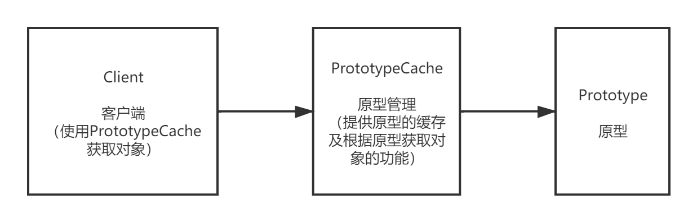

## 原型模式（Prototype）
+ 设计模式学习笔记：原型模式（Prototype）
+ https://blog.csdn.net/sinat_27245917/article/details/107517664
+ 一、原型模式简介
    - 原型模式属于设计模式中的创建型模式。原型模式使用较小的代价创建重复的对象，提供了一种创建对象的最佳方式。
    - 原型模式通常使用克隆来创建对象，它解决的问题是有些对象的创建代价过大的问题，例如一个对象需要花费较大的代价查询数据库后创建，
      这种情况我们就可以缓存这个对象，下一次创建时直接返回它的克隆，需要时再更新数据库，以此来减少数据库的调用。
  
+ 二、实现方式
    - 代码实现共有三个类：
      - Prototype： 原型
      - PrototypeCache： 原型管理类
      - Client： 客户端

